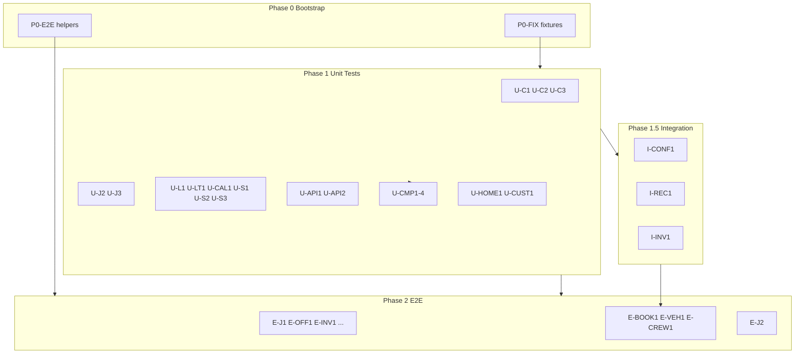

# Testing Coverage Expansion Plan

## Status tracker

Update this table as packages merge. **One agent = one package = one branch = one PR.**

| Package     | Status      | Branch                     | Notes                                                       |
| ----------- | ----------- | -------------------------- | ----------------------------------------------------------- |
| P0-FIX      | merged      | —                          | All fixtures in `src/test/fixtures/`                        |
| P0-E2E      | merged      | —                          | `e2e/helpers/navigation.ts`                                 |
| U-C1        | done        | `test/U-C1-overlap-checks` | `overlapChecks.test.ts` — 7 tests                           |
| U-C2        | done        | `test/U-C2-force-booking`  | `forceBooking.test.ts` — 11 tests                           |
| U-L1        | done        | `test/U-L1-logging-ranges` | `timeEntryRange.test.ts` — 10 tests                         |
| U-LT1       | done        | —                          | 3 files in `src/features/latest/utils/`                     |
| U-CAL1      | done        | —                          | `domain.test.ts` — 7 tests                                  |
| U-S1        | done        | —                          | `fuzzySearch.test.ts` — 4 tests                             |
| U-S2        | done        | —                          | Expanded `permissions.test.ts`, `phone.test.ts`             |
| U-J2        | done        | —                          | `contaProjects`, `statusColors`, `offerPdfExport`           |
| U-J3        | done        | —                          | `aggregateRecurringJobCrew`, `recurringJobCreateDefaults`   |
| U-HOME1     | done        | —                          | `dailyInspiration.test.ts` — 5 tests                        |
| U-C3        | done        | —                          | `equipmentConflictCheck.test.ts` — 3 tests                  |
| U-CUST1     | done        | —                          | `contaCustomerCheck.test.ts` — 4 tests                      |
| U-S3        | done        | —                          | `customerSyncCore.test.ts` — 2 tests                        |
| U-API1      | done        | —                          | `feed.test.ts` — 4 tests (token, 405, OPTIONS, env)         |
| U-API2      | done        | —                          | `sync-conta.test.ts`, `trigger-conta-sync.test.ts`          |
| U-CMP1–4    | done        | —                          | Equipment, Crew, Transport, SearchableSelect (fixed U-CMP4) |
| I-CONF1     | done        | —                          | `conflicts.booking.test.ts`                                 |
| I-REC1      | done        | —                          | `recurringJobs.test.ts`                                     |
| I-INV1      | done        | —                          | `inventory.booking.test.ts`                                 |
| E-J1        | done        | —                          | `e2e/jobs.spec.ts` — 6 tests incl. status change            |
| E-OFF1      | smoke       | —                          | Lock flow covered; duplicate/pretty offer still optional    |
| E-INV1      | done        | —                          | Add item flow + search                                      |
| E-CUST1     | done        | —                          | Create customer + inspector                                 |
| E-CAL1      | done        | —                          | Category filter → equipment search                          |
| E-LOG1      | done        | —                          | Month switch on entries view                                |
| E-BOOK1     | done        | —                          | Book equipment, conflict dialog, force-book                 |
| E-VEH1      | done        | —                          | Book vehicle on job transport tab                           |
| E-CREW1     | done        | —                          | Add role + Add Crew to Role dialog                          |
| E-COMP1     | done        | —                          | Owner settings smoke                                        |
| E-AUTH1     | done        | —                          | employeePage/freelancerPage + route matrix                  |
| E-J2        | done        | —                          | Create recurring job + inspector tabs                       |
| FIX-HYGIENE | done        | —                          | DateTimeRangePicker stability, fixture wiring               |
| I-SEED      | done        | —                          | Conflict booking seed (dedicated conflict job)              |
| I-CONF2     | done        | —                          | Force-book write-path integration                           |
| I-REC2      | done        | —                          | Recurring template CRUD integration                         |
| I-INV2      | done        | —                          | Reserve item golden-path integration                        |
| CI-COV      | done        | —                          | Folder-scoped coverage thresholds in CI                     |

**Extra (outside plan):** DateTimePicker + picker subcomponents — done (9 component test files).

**Coordinator snapshot (2026-06-30, Phase 2 complete):**

- **Unit:** `npm run test` — **43 files, 254 tests, all passing**
- **Integration:** 4 files, **43 tests passing** (write paths for conflicts, recurring templates, inventory)
- **E2E:** 14 spec files, **22+ scenarios** in Phase 2 packages (bookings, roles, recurring, inventory/customers/calendar/logging/crew/vehicles)

**Phase 2 complete.** Optional follow-ups: calendar event click, E-OFF1 duplicate/pretty offer, unit deepening (U-CONF-DEEP, U-SYNC).

### E2E expansion checklist (assign one spec per agent)

| ID      | File                         | Has smoke test? | Still needed (from plan)                    |
| ------- | ---------------------------- | --------------- | ------------------------------------------- |
| E-J1    | `e2e/jobs.spec.ts`           | Yes (6 tests)   | — (status change added)                     |
| E-OFF1  | `e2e/offers.spec.ts`         | Yes (141 lines) | Lock, duplicate, pretty offer if missing    |
| E-INV1  | `e2e/inventory.spec.ts`      | Yes             | Add item flow                               |
| E-CUST1 | `e2e/customers.spec.ts`      | Yes             | Create, inspector                           |
| E-CAL1  | `e2e/calendar.spec.ts`       | Yes             | Filter, click event                         |
| E-LOG1  | `e2e/logging.spec.ts`        | Yes             | Switch month/year                           |
| E-BOOK1 | `e2e/bookings.spec.ts`       | Yes             | Book equipment, conflict banner, force-book |
| E-VEH1  | `e2e/vehicles.spec.ts`       | Yes             | Book on job                                 |
| E-CREW1 | `e2e/crew.spec.ts`           | Yes             | Assign crew, conflict display               |
| E-COMP1 | `e2e/company.spec.ts`        | Yes             | Owner settings smoke (may suffice)          |
| E-AUTH1 | `e2e/roles.spec.ts`          | Yes             | Freelancer/employee route denial            |
| E-J2    | `e2e/recurring-jobs.spec.ts` | Yes             | Template, instances, crew tab               |

Verify per package: `npm run test:e2e -- e2e/<file>.spec.ts`

---

## Goal

Move from **17 unit test files / 4 E2E specs** to thorough coverage of pure business logic, critical DB flows, and major user journeys — without agents stepping on each other's files.

**Quality gates for every package:** `npm run check`, `npm run test` (or `test:integration` / `test:e2e` as applicable), `npm run build:check`.

**Existing docs to align with:** [docs/TESTING.md](TESTING.md) — this plan extends it; after execution, update that doc with new test locations.

---

## Architecture: how work is split



**Isolation rule:** Each package lists exact owned files. Agents must not edit files outside their package except P0 bootstrap agents.

---

## Phase 0 — Bootstrap (sequential, 2 agents max)

### P0-FIX — Shared unit-test fixtures

**Owns:** new files under [src/test/fixtures/](../src/test/fixtures/) only

| New fixture        | Consumers        |
| ------------------ | ---------------- |
| `conflicts.ts`     | U-C1, U-C2, U-C3 |
| `calendar.ts`      | U-CAL1           |
| `recurringJobs.ts` | U-J3, I-REC1     |
| `logging.ts`       | U-L1             |
| `latest.ts`        | U-LT1            |

Factory/builder functions only — no production code, no tests. Reuse patterns from [src/test/fixtures/offers.ts](../src/test/fixtures/offers.ts).

### P0-E2E — Shared Playwright helpers

**Owns:** new folder `e2e/helpers/` + may refactor existing specs to import helpers

Extract duplicated navigation from [e2e/jobs.spec.ts](../e2e/jobs.spec.ts) and [e2e/offers.spec.ts](../e2e/offers.spec.ts):

- `openJobsPage(page)`
- `openInventoryPage(page)`
- `createDraftJob(page, title?)`

**Only P0-E2E** may edit existing spec files during extraction. All later E2E agents create new spec files only.

---

## Phase 1 — Unit tests (parallel waves)

### Wave 1 — No dependencies (10 agents in parallel)

#### U-C1 — Overlap deduplication

|                |                                                                                               |
| -------------- | --------------------------------------------------------------------------------------------- |
| **Production** | [src/features/conflicts/api/overlapChecks.ts](../src/features/conflicts/api/overlapChecks.ts) |
| **Test**       | `overlapChecks.test.ts` (colocated)                                                           |
| **Block**      | U-C2, U-C3, equipmentConflictCheck                                                            |

Test `dedupeOverlapConflicts`: empty input, merge overlapping same-key periods, keep non-overlapping separate, max quantity, different items/jobs stay separate.

Optional in-scope refactor: extract `periodsOverlap` to [src/features/conflicts/utils/periodsOverlap.ts](../src/features/conflicts/utils/periodsOverlap.ts) if needed.

---

#### U-C2 — Force-booking helpers

|                |                                                                                             |
| -------------- | ------------------------------------------------------------------------------------------- |
| **Production** | [src/features/conflicts/api/forceBooking.ts](../src/features/conflicts/api/forceBooking.ts) |
| **Test**       | `forceBooking.test.ts`                                                                      |

Test: `BookingOverlapError`, `isBookingOverlapError`, `forcedBookingFields`, `isCrewOverlapError`, `isVehicleOverlapError`, `isEquipmentCapacityError`.

---

#### U-L1 — Logging date ranges

|                |                                                                                             |
| -------------- | ------------------------------------------------------------------------------------------- |
| **Production** | [src/features/logging/lib/timeEntryRange.ts](../src/features/logging/lib/timeEntryRange.ts) |
| **Test**       | `timeEntryRange.test.ts`                                                                    |

Use `vi.setSystemTime` for deterministic `getRange`, `formatLoggingDate`, `formatMonthInput`, `getMonthOptions`, invalid month input fallback.

---

#### U-LT1 — Latest feed utils

|                |                                                                                                                                                                                                                                                                             |
| -------------- | --------------------------------------------------------------------------------------------------------------------------------------------------------------------------------------------------------------------------------------------------------------------------- |
| **Production** | [src/features/latest/utils/formatActivityDate.ts](../src/features/latest/utils/formatActivityDate.ts), [groupInventoryActivities.ts](../src/features/latest/utils/groupInventoryActivities.ts), [activityNavigation.ts](../src/features/latest/utils/activityNavigation.ts) |
| **Tests**      | one `*.test.ts` per file                                                                                                                                                                                                                                                    |

Focus: 1-hour grouping window in `groupInventoryActivities`, route mapping in `activityNavigation`.

---

#### U-CAL1 — Calendar domain

|                |                                                                                             |
| -------------- | ------------------------------------------------------------------------------------------- |
| **Production** | [src/features/calendar/components/domain.ts](../src/features/calendar/components/domain.ts) |
| **Test**       | `domain.test.ts`                                                                            |

Test `toEventInputs` and `applyCalendarFilter` (kind, scope filters, fuzzy text). Do not touch [freelancerCalendarVisibility.ts](../src/features/calendar/api/freelancerCalendarVisibility.ts) (already tested).

---

#### U-S1 — Fuzzy search builder

|                |                                                                   |
| -------------- | ----------------------------------------------------------------- |
| **Production** | [src/shared/api/fuzzySearch.ts](../src/shared/api/fuzzySearch.ts) |
| **Test**       | `fuzzySearch.test.ts`                                             |

Test `applyFuzzySearch` with mock query builder (`.or()` spy). Skip `fuzzySearchRPC` throw path unless implementing it.

---

#### U-S2 — Auth and phone gaps

|                |                                                                                                                                                           |
| -------------- | --------------------------------------------------------------------------------------------------------------------------------------------------------- |
| **Production** | expand [src/shared/auth/permissions.test.ts](../src/shared/auth/permissions.test.ts), [src/shared/phone/phone.test.ts](../src/shared/phone/phone.test.ts) |
| **Block**      | `useAuthz.ts`                                                                                                                                             |

Add missing role/capability edge cases and uncovered phone formats.

---

#### U-J2 — Remaining jobs utils

|                |                                                                                                                                                                                                   |
| -------------- | ------------------------------------------------------------------------------------------------------------------------------------------------------------------------------------------------- |
| **Production** | [contaProjects.ts](../src/features/jobs/utils/contaProjects.ts), [statusColors.ts](../src/features/jobs/utils/statusColors.ts), [offerPdfExport.ts](../src/features/jobs/utils/offerPdfExport.ts) |
| **Tests**      | colocated `*.test.ts`                                                                                                                                                                             |

- `statusColors`: every job status maps to expected token
- `offerPdfExport`: smoke test with fixture from `@test/fixtures/offers` — no throw
- `contaProjects`: pure transforms only; mock async Conta calls

Do not touch already-tested utils (`offerCalculations`, `offerValidation`, etc.).

---

#### U-J3 — Recurring jobs utils (expand)

|                |                                                                                                                                                                                    |
| -------------- | ---------------------------------------------------------------------------------------------------------------------------------------------------------------------------------- |
| **Production** | [aggregateRecurringJobCrew.ts](../src/features/jobs/utils/aggregateRecurringJobCrew.ts), [recurringJobCreateDefaults.ts](../src/features/jobs/utils/recurringJobCreateDefaults.ts) |
| **Tests**      | expand existing tests                                                                                                                                                              |

Multi-instance crew aggregation, empty templates, default date boundaries. Use P0 `recurringJobs.ts` fixtures.

---

#### U-HOME1 — Home utils

|                |                                                                                               |
| -------------- | --------------------------------------------------------------------------------------------- |
| **Production** | [src/features/home/utils/dailyInspiration.ts](../src/features/home/utils/dailyInspiration.ts) |
| **Test**       | `dailyInspiration.test.ts`                                                                    |

Deterministic output given fixed date/index inputs.

---

### Wave 2 — After P0-FIX (5 agents in parallel)

#### U-C3 — Equipment quantity map

|                      |                                                                                                                 |
| -------------------- | --------------------------------------------------------------------------------------------------------------- |
| **Production**       | [equipmentConflictCheck.ts](../src/features/conflicts/api/equipmentConflictCheck.ts)                            |
| **Test**             | `equipmentConflictCheck.test.ts`                                                                                |
| **Optional extract** | [src/features/conflicts/utils/equipmentQuantityMap.ts](../src/features/conflicts/utils/equipmentQuantityMap.ts) |

Test `buildOfferItemQuantityMap`: direct items, group expansion, quantity math. Mock `supabase` or inject fetch. **Out of scope:** `getEquipmentConflictsForOfferBooking` full flow.

---

#### U-CUST1 — Conta customer check

|                |                                                                                                             |
| -------------- | ----------------------------------------------------------------------------------------------------------- |
| **Production** | [src/features/customers/utils/contaCustomerCheck.ts](../src/features/customers/utils/contaCustomerCheck.ts) |
| **Test**       | `contaCustomerCheck.test.ts`                                                                                |

Mock `contaClient.get`: missing org no, match, no match, API error.

---

#### U-S3 — Conta sync core

|                |                                                                                           |
| -------------- | ----------------------------------------------------------------------------------------- |
| **Production** | [src/shared/conta/contaCustomerSyncCore.ts](../src/shared/conta/contaCustomerSyncCore.ts) |
| **Test**       | `contaCustomerSyncCore.test.ts`                                                           |

Test pure diff/skip/create/update helpers. Do not expand [contaCustomerSyncCron.test.ts](../src/shared/conta/contaCustomerSyncCron.test.ts).

---

#### U-API1 — Calendar feed (expand)

|                |                                                                  |
| -------------- | ---------------------------------------------------------------- |
| **Production** | [api/calendar/feed.ts](../api/calendar/feed.ts)                  |
| **Test**       | expand [api/calendar/feed.test.ts](../api/calendar/feed.test.ts) |

Add auth/token/OPTIONS/malformed-param branches with mocked Supabase. Do not touch [icsHelpers.ts](../api/calendar/icsHelpers.ts) (98% covered).

---

#### U-API2 — Cron / super API handlers

|                |                                                                                                                            |
| -------------- | -------------------------------------------------------------------------------------------------------------------------- |
| **Production** | [api/cron/sync-conta.ts](../api/cron/sync-conta.ts), [api/super/trigger-conta-sync.ts](../api/super/trigger-conta-sync.ts) |
| **Tests**      | colocated `*.test.ts`                                                                                                      |

HTTP method guards, missing env, cron secret validation. Mock downstream sync.

---

### Wave 3 — Component unit tests (4 agents, after Wave 1)

Each uses [src/test/render.tsx](../src/test/render.tsx). Mock TanStack Query — no real Supabase.

| ID         | Component                                                                                                   | Test file                   |
| ---------- | ----------------------------------------------------------------------------------------------------------- | --------------------------- |
| **U-CMP1** | [EquipmentSection.tsx](../src/features/jobs/components/dialogs/technical-offer-editor/EquipmentSection.tsx) | `EquipmentSection.test.tsx` |
| **U-CMP2** | [CrewSection.tsx](../src/features/jobs/components/dialogs/technical-offer-editor/CrewSection.tsx)           | `CrewSection.test.tsx`      |
| **U-CMP3** | [TransportSection.tsx](../src/features/jobs/components/dialogs/technical-offer-editor/TransportSection.tsx) | `TransportSection.test.tsx` |
| **U-CMP4** | [SearchableSelect.tsx](../src/shared/ui/components/SearchableSelect.tsx)                                    | `SearchableSelect.test.tsx` |

Do not touch [TotalsSection.test.tsx](../src/features/jobs/components/dialogs/technical-offer-editor/TotalsSection.test.tsx) (already exists).

**Deferred:** [DateTimePicker.tsx](../src/shared/ui/components/DateTimePicker.tsx) — done ahead of schedule.

---

## Phase 1.5 — Integration tests (after Wave 1 conflicts + recurring utils)

Pattern: [src/test/integration/offers.public.test.ts](../src/test/integration/offers.public.test.ts) — `integrationEnabled` guard, [supabaseClient.ts](../src/test/integration/supabaseClient.ts), seeded users via `npm run db:seed-test-users`.

| ID          | New file                                         | Scope                                                      |
| ----------- | ------------------------------------------------ | ---------------------------------------------------------- |
| **I-CONF1** | `src/test/integration/conflicts.booking.test.ts` | Overlap detection RPCs, force-book path, employee vs owner |
| **I-REC1**  | `src/test/integration/recurringJobs.test.ts`     | Recurring template CRUD, instance generation               |
| **I-INV1**  | `src/test/integration/inventory.booking.test.ts` | Reserve items, capacity limits                             |

Each agent owns **one integration file**. No shared edits to seed script unless adding minimal seed rows — coordinate seed changes through a single **I-SEED** sub-task if needed.

Run locally: `RUN_INTEGRATION_TESTS=1 npm run test:integration`

---

## Phase 2 — E2E tests (after P0-E2E + Phase 1 Wave 1)

Use [e2e/fixtures.ts](../e2e/fixtures.ts) `authedPage`. Follow patterns in [docs/TESTING.md](TESTING.md) (sidebar nav, placeholders for login, `Date.now()` titles).

### Wave 1 — Core flows (6 agents parallel)

| ID          | Spec                                               | Scenarios                               |
| ----------- | -------------------------------------------------- | --------------------------------------- |
| **E-J1**    | expand [e2e/jobs.spec.ts](../e2e/jobs.spec.ts)     | Edit job, status change, tab navigation |
| **E-OFF1**  | expand [e2e/offers.spec.ts](../e2e/offers.spec.ts) | Lock, duplicate, pretty offer           |
| **E-INV1**  | new `e2e/inventory.spec.ts`                        | List, add item, search                  |
| **E-CUST1** | new `e2e/customers.spec.ts`                        | Create, search, inspector               |
| **E-CAL1**  | new `e2e/calendar.spec.ts`                         | Open, filter, click event               |
| **E-LOG1**  | new `e2e/logging.spec.ts`                          | View entries, switch month/year         |

### Wave 2 — Booking and roles (5 agents parallel)

| ID          | Spec                       | Scenarios                                   |
| ----------- | -------------------------- | ------------------------------------------- |
| **E-BOOK1** | new `e2e/bookings.spec.ts` | Book equipment, conflict banner, force-book |
| **E-VEH1**  | new `e2e/vehicles.spec.ts` | Add vehicle, book on job                    |
| **E-CREW1** | new `e2e/crew.spec.ts`     | Assign crew, conflict display               |
| **E-COMP1** | new `e2e/company.spec.ts`  | Owner settings smoke                        |
| **E-AUTH1** | new `e2e/roles.spec.ts`    | Freelancer/employee route denial            |

### Wave 3 — Recurring (1 agent, after feature stable)

| ID       | Spec                             | Scenarios                                 |
| -------- | -------------------------------- | ----------------------------------------- |
| **E-J2** | new `e2e/recurring-jobs.spec.ts` | Create template, view instances, crew tab |

**Do not modify:** [e2e/login.spec.ts](../e2e/login.spec.ts), [e2e/public-offer.spec.ts](../e2e/public-offer.spec.ts) unless assigned explicitly.

Verify per package: `npm run test:e2e -- e2e/<file>.spec.ts`

---

## Already covered — maintenance only

Do not assign agents unless extending for new features:

- offerCalculations, offerValidation, offerNumber, jobStatusAutoTransition, groupBookingQuantity
- conflictCategories, mergeEquipmentConflicts
- permissions, generalFunctions
- icsHelpers, freelancerCalendarVisibility
- offers.public integration test

---

## How to run multiple Cursor agents on this plan

### Recommended workflow

1. **One agent = one package = one branch = one PR**
2. **Use separate Cursor chats (or Background Agents) per package** — paste only the relevant package section
3. **Respect wave order** — P0 done; Wave 1 can run in parallel
4. **Coordinator** tracks status in the table above and runs `npm run test:all` after merge batches

### Agent assignment template

```markdown
## Package: [U-C1]

### Owned files

- Production: [list]
- Tests: [list]

### Forbidden

- Do not edit: [list adjacent packages/files]

### Instructions

1. Follow patterns in [example.test.ts path]
2. Use @test/fixtures/\* where noted
3. import type for type-only imports (verbatimModuleSyntax)
4. Run: npm run check && npm run test && npm run build:check
5. For E2E: npm run test:e2e -- e2e/<file>.spec.ts

### Done when

- [ ] All scenarios in package spec have tests
- [ ] CI gates pass
- [ ] No files outside owned scope changed
```

### Merge strategy

| Batch | Packages                  | Merge order                           |
| ----- | ------------------------- | ------------------------------------- |
| 1     | P0-FIX                    | Done                                  |
| 2     | Wave 1 unit (10 PRs)      | Parallel merge, rebase as needed      |
| 3     | Wave 2 unit (5 PRs)       | After batch 1                         |
| 4     | Wave 3 components (4 PRs) | After batch 2                         |
| 5     | Integration (3 PRs)       | After conflicts/recurring unit merged |
| 6     | P0-E2E                    | Done                                  |
| 7     | E2E waves                 | Parallel within wave                  |

Target end state: **~35+ unit files**, **3 integration files**, **~12 E2E specs**, all passing `npm run test:all`.

---

## Explicitly deferred

| Area                               | Reason                                               |
| ---------------------------------- | ---------------------------------------------------- |
| `src/features/jobs/api/*.ts`       | Thin Supabase wrappers — integration/E2E instead     |
| Page components (`JobsPage`, etc.) | E2E coverage                                         |
| Supabase Edge Functions            | Separate infra setup                                 |
| Mandatory 80% line coverage        | Contradicts [docs/TESTING.md](TESTING.md) philosophy |
